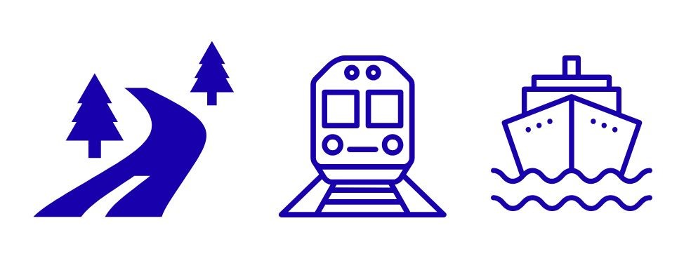
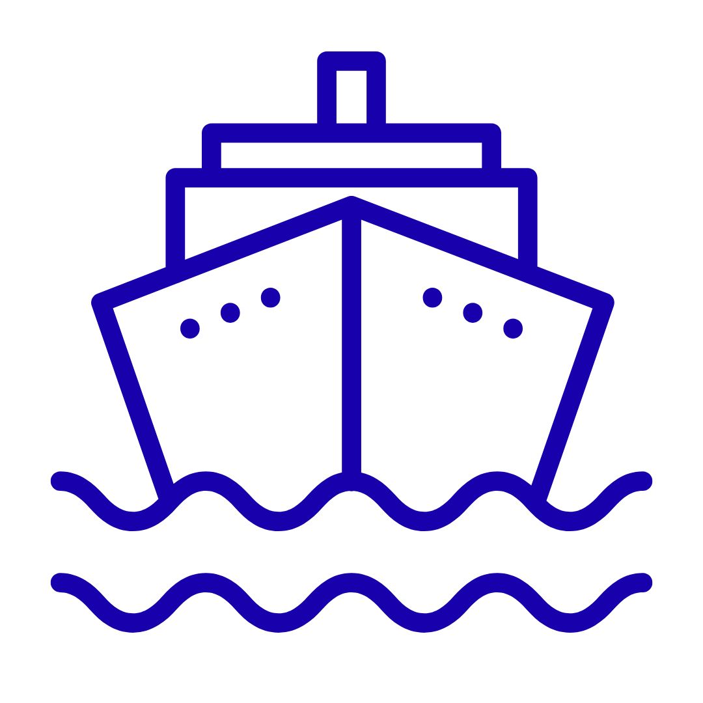

<!--   -->

### How is climate change expected to impact traffic and transport in the Baltic Sea Region? 

Whether you operate at road, rail, or sea, this website provides information on changes in climatic conditions through variables that are the most relevant for your operations. 

Click a variable to explore visual results related to it. In the menu below, each variable is followed by icons of the affected transport modes and a short description.

---

<!-- CARD 1 -->

  <a href="preciptype.html"><strong>Precipitation Type</strong></a>
  

    
    
    
  

  
Forms of precipitation influencing visibility, surface conditions, and maintenance needs.

<!-- CARD 2 -->

  <a href="preciptype.html"><strong>Rainfall</strong></a>
  

    
    
  

  
Accumulated or intense rainfall affecting friction, drainage, and potential flooding.

<!-- CARD 3 -->

  <a href="R20mm_CORDEX.html"><strong>Wind</strong></a>
  

    
  

  
Surface winds influencing waves, ship handling, and maritime safety.

<!-- CARD 4 -->

  <a href="Rx1day_CORDEX.html"><strong>Precipitation Index (Rx1day)</strong></a>
  

    
  

  
Extreme 1-day precipitation amounts relevant for rail drainage and landslide risk.

<!-- CARD 5 -->

  <a href="Rx1day_CORDEX.html"><strong>Sea Ice</strong></a>
  

    
  

  
Sea-ice extent and thickness affecting navigability and port operations.

<!-- CARD 6 -->

  <a href="preciptype.html"><strong>Waves</strong></a>
  

    
  

  
Wave height and period impacting maritime routing and port safety.

<!-- CARD 7 -->

  <a href="roadweather.md"><strong>Road Surface Temperature</strong></a>
  

    
  

  
Controls icing risk and affects winter road maintenance planning.

<!-- CARD 8 -->

  <a href="roadweather.md"><strong>Freeze–Thaw Cycles</strong></a>
  

    
    
  

  
Repeated freezing and thawing degrade pavements and rail ballast.

<!-- CARD 9 -->

  <a href="roadweather.md"><strong>Surface Cover</strong></a>
  

    
  

  
Snow, ice, and slush modify friction and visibility on roads.

