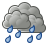
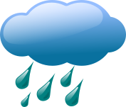

<!--   -->

###   Maritime 

<!--
  • [Precipitation Type](preciptype.md) 
  • Rainfall 
  • Wind 
  • [Precipitation Index](Rx1day_CORDEX.md)  
    • Sea ice ? 
-->
<ul>
  <li>
    <a href="preciptype.html">
      
      Precipitation Type
    </a>
  </li>
  <li>
    <a href="preciptype.html">
      
      Rainfall
    </a>
  </li>
  <li>
    <a href="preciptype.html">
      
      Wind
    </a>
  </li>
    <li>
    <a href="Rx1day_CORDEX.html">
      
      Precipitation Index
    </a>
  </li>
    <li>
    <a href="Rx1day_CORDEX.html">
      
      Sea-ice
    </a>
  </li>  
</ul>
 
 
    

###   Roads
  • [Road surface temperature, freeze-thaw cycles & surface cover](roadweather.md) 
 
 

###   Rail
  • Wind ? 
  • Waves ? 

