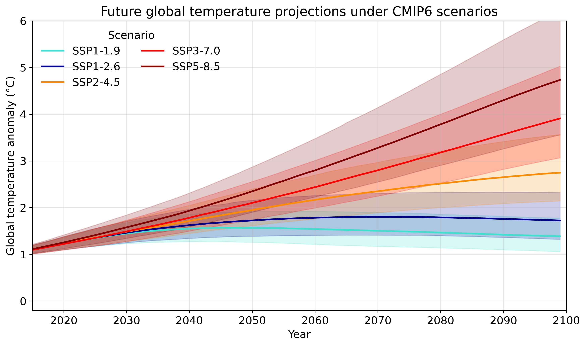

Climate projections are based on alternative future emission pathways, known as Shared Socioeconomic Pathways (SSPs). They describe how greenhouse-gas emissions, land use, air pollution and socioeconomic development may evolve during this century.

The scenarios are not predictions of the future. Instead, they provide consistent assumptions for assessing how different levels of global warming could affect climate, ecosystems and society. Lower-emission pathways assume rapid mitigation of greenhouse-gas emissions, while higher-emission pathways describe futures with more limited mitigation and substantially greater warming.

The CMIP6 scenarios combine two elements: a socioeconomic pathway (SSP) and an assumed level of climate forcing by 2100. The SSP describes the broader societal development pathway, whereas the number indicates the resulting strength of human influence on Earth’s energy balance.

The pathways used here represent a range of plausible future developments:

• SSP1 –  sustainability, taking the green road: A sustainable path 
emphasizing inclusive development, environmental boundaries, 
and reduced inequality → decreasing emissions​

• SSP2 – middle of the road: A continuation of historical social, 
economic, and technological patterns with uneven progress → 
moderate emissions ​

• SSP3 –  regional rivalry: fragmented world driven by resurgent 
nationalism, regional security, and low international cooperation → 
high emissions ​

• SSP5 –  fossil-fuel development: Rapid technological progress 
and human capital development driven by competitive markets and 
heavy fossil fuel reliance → very high emissions.​

  

The numbers in scenario names (e.g. 4.5, 8.5) describe the level of 
radiative forcing (W/m2) by the end of 21st century. That means the 
energy imbalance caused by emissions, so how much extra energy 
stays in the Earth system
