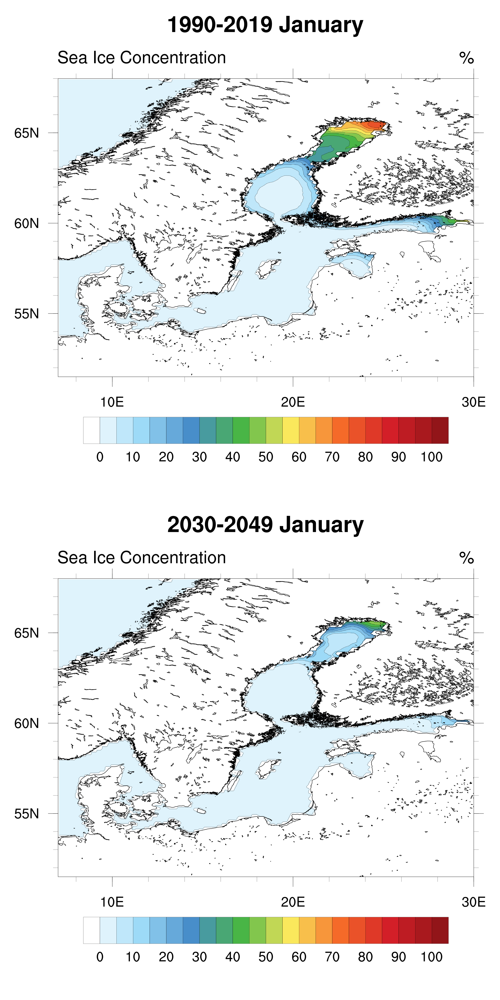

---
 

Sea ice concentration is the fraction (or percentage) of the ocean surface that is covered by sea ice within a given area. It ranges from 0 (completely ice-free water) to 1 or 100% (entirely ice-covered) and is commonly derived from satellite observations, but can be also simulated with climate models. 
<strong>Limitations:</strong> Sea ice concentration describes the fractional ice cover but does not capture ice thickness, ice strength, or ice type. As a result, areas with the same concentration may have very different navigability or hazard levels.

The model data used in the figures shown above are based on climate Digital Twin (nextGEMS) simulations. These are high-resolution simulations that provide detailed spatial information, for example for sea ice conditions in the Baltic Sea. However, it should be noted that the results are based on a single model and a single realization, and that simulated conditions may differ slightly from observations even for historical periods. High-resolution information on sea ice conditions is generally limited. Despite these limitations, the simulations provide a useful indication of how sea ice conditions may change in the future.

# How to use
The figures show average sea ice concentration for each month for a near-historical period (1990–2019) and a future period (2030–2049), based on the high-emission scenario SSP3-7.0. The displayed month can be selected using the drop-down menus.

The presented values are multi-year means. Interannual variability is not shown, and conditions in individual years may differ from the average.

---

# Sea Ice Concentration
{:#seaice}

  <label for="month" style="margin-left: 15px;">Month: </label>
  <select id="month">
    <option value="0">January</option>
    <option value="1">February</option>
    <option value="2">March</option>
    <option value="3">April</option>
    <option value="4">May</option>
    <option value="5">June</option>
    <option value="6">July</option>
    <option value="7">August</option>
    <option value="8">September</option>
    <option value="9">October</option>
    <option value="10">November</option>
    <option value="11">December</option>
  </select>

   

# Interpretation
Based on these climate modeling simulations, sea ice cover is at its greatest extent on average in March and April. However, climate change is expected to significantly reduce the extent of sea ice cover as early as the coming decades. According to the results, in a couple of decades, the ice cover will only extend to the northernmost parts of the Bothnian Bay and the Gulf of Finland. It should be noted, however, that there are still differences between individual years.

# Further Information
{:#further-info}
Used scenario: Historical until 2015 - from 2015: SSP3-7.0 (a high greenhouse-gas emissions climate scenario)

Used Data: Climate Digital Twins, nextGEMS, model: IFS-FESOM - https://destine.ecmwf.int/climate-change-adaptation-digital-twin-climate-dt/

Periods:  1990–2019 and 2030–2049  

Page author: Anton Laakso
   
